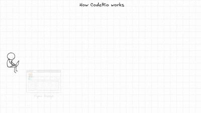

<div align="center">

# 🎨 CodeRio

AI-Powered Design-to-Code Tool with High-Fidelity UI Restoration

[](LICENSE) [](https://nodejs.org/) [](https://www.npmjs.com/package/coderio) [](https://github.com/MigoXLab/coderio/graphs/contributors)

💬 Contact: <a href="https://aicarrier.feishu.cn/docx/KTZCddG2VoarFExTqBEcS55QnRd" target="_blank">WeChat Group</a> | <a href="mailto:coderio&#64;pjlab&#46;org&#46;cn">Email</a>

[English](README.md) | [简体中文](README_zh-CN.md)

</div>

---

## 📑 Table of Contents

- [What is CodeRio?](#what-is-coderio)
- [Examples](#-examples)
- [Quick Start](#-quick-start)
- [All Commands](#-all-commands)
- [Key Features](#-key-features)
- [How It Works](#-how-it-works)
- [Roadmap](#-roadmap)
- [Contributing](#-contributing)
- [License](#-license)

---

## What is CodeRio?

CodeRio is an intelligent **Figma-to-Code** automation tool that transforms designs into production-ready React code. Unlike traditional converters, CodeRio employs a multi-agent system that validates visual accuracy and iteratively refines misalignments, pursuing high-fidelity UI restoration and **production-ready code structure tailored for developers**.



**Perfect for:**

- 🎯 Frontend developers who want accurate design implementation
- 🚀 Teams looking to accelerate development workflows
- 💎 Designers who want their vision precisely realized in code

## ✨ Examples

### Case: CLI with --mode full

This example demonstrates a landing page converted from Figma. It includes a header, main content area, and footer, showcasing CodeRio's ability to handle complex layouts, multiple images and component structures.

<a href="https://static.openxlab.org.cn/coderio/report.html" target="_blank">📊 View Interactive Validation Report</a>

### Case: Development with Cursor Skill

CodeRio can be seamlessly integrated into Cursor as a Skill. Simply input a prompt like **"Create a React project and restore this design with high fidelity,"** along with your output directory, Figma URL, and Token. The Agent will guide you step-by-step through the page generation process. For Landing Pages, it achieves **high-fidelity restoration**, accurately reproducing images and styles. It also automatically encapsulates reusable components (such as cards) and strictly adheres to **frontend development best practices**.

<a href="https://static.openxlab.org.cn/coderio/coderio-skill-demo.mp4" target="_blank">🎥 Watch Demo Video</a>

## 🚀 Quick Start

### Option 1: CLI (Recommended 👍🏻)
Best for one-click generation.

#### 1. Prerequisites

- Node.js >= 18.0.0 (< 25.0.0)
- [Figma Personal Access Token](https://www.figma.com/developers/api#access-tokens)
- LLM API Key ([Anthropic](https://console.anthropic.com/) | [OpenAI](https://platform.openai.com/) | [Google](https://aistudio.google.com/))

#### 2. Installation

```bash
# Install globally (recommended)
npm install -g coderio

# Or using pnpm
pnpm add -g coderio
```

> **Note for pnpm v9+ users**: If you see a warning about "Ignored build scripts", run:
>
> ```bash
> pnpm approve-builds
> ```
>
> This allows native dependencies (better-sqlite3) to compile properly.
>
> **Note**: `playwright` and `sharp` are required only for validation features. They will be automatically installed when you first run a command that needs them (like `d2c --mode full`).

#### 3. Configuration

Create `~/.coderio/config.yaml`:

```bash
mkdir -p ~/.coderio
cat > ~/.coderio/config.yaml << 'EOF'
model:
  provider: openai          # anthropic | openai | google
  model: gemini-3-pro-preview
  baseUrl: https://api.anthropic.com
  apiKey: your-api-key-here

figma:
  token: your-figma-token-here

debug:
  enabled: false
EOF
```

#### 4. Usage

```bash
# Convert Figma design to code (default mode: code only)
coderio d2c -s 'https://www.figma.com/design/your-file-id/...'

# Full mode: Generate code + visual validation + auto-refinement
coderio d2c -s 'https://www.figma.com/design/your-file-id/...' -m full
```

#### 5. Run Your Project

```bash
# Navigate to generated project
cd coderio/<design-name_node-id>/my-app

# Install dependencies
pnpm install

# Start dev server
pnpm dev

# 🎉 Open http://localhost:5173
```

#### 6. View Validation Report

```bash
# Open validation report in browser
open coderio/<design-name_node-id>/process/validation/index.html
```

#### 📖 All Commands

| Command           | Alias | Description                                         |
| ----------------- | ----- | --------------------------------------------------- |
| `design2code`     | `d2c` | Full pipeline: Figma → Protocol → Code → Validation |
| `design2protocol` | `d2p` | Extract design protocol only                        |
| `protocol2code`   | `p2c` | Generate code from existing protocol                |
| `validate`        | `val` | Run validation on generated code                    |
| `images`          | -     | Download and process Figma assets                   |

### Option 2: Skill (Portable Embedded Workflow)
Best for control and precision using AI Agents.

**Prerequisites**:
Copy the Skill file to your Cursor configuration directory:
```bash
mkdir -p ~/.cursor/skills/design-to-code
cp docs/skills/SKILL.md ~/.cursor/skills/design-to-code/SKILL.md
```

**Using in Cursor**:
1. Open Cursor Chat (`Cmd` + `L`).
2. Type: **"Use design-to-code skill to convert this design: [Your Figma URL]"**
3. The Agent will guide you step-by-step through protocol extraction and code generation.

**Using in Claude Code**:
1. Start Claude Code.
2. Type: **"Read docs/skills/SKILL.md and perform design conversion: [Your Figma URL]"**

## 💎 Key Features

### 1. Intelligent Design Protocol Generation

Generates comprehensive frontend protocols combining page component structure, CSS code, and static assets:

- **Component Hierarchy**: Automatically identifies component structure and data states, forming a component hierarchy skeleton that aligns with frontend development practices
- **Style Extraction**: Translates Figma JSON into CSS properties, including colors, spacing, shadows, animations, etc.
- **Asset Optimization**: Automatically identifies and processes image nodes

```typescript
interface Protocol {
    id: string; // Component identifier (e.g., "Header", "Hero")
    data: {
        name: string; // Component name
        purpose: string; // Semantic description
        elements: FigmaFrameInfo[]; // Original Figma node data
        layout?: LayoutInfo; // Position, size, spacing, direction
        componentName?: string; // Reusable component identifier
        props?: PropDefinition[]; // Component props schema
        states?: StateData[]; // Component state variations
    };
    children?: Protocol[]; // Nested child components
}
```

### 2. Visual Validation & Calibration

Ensures pixel-perfect accuracy with automated visual testing:

- **Position Calibration**: Measures exact element positioning using computer vision
- **Visual Diff Reports**: Interactive HTML reports with heatmaps and side-by-side comparisons
- **Automated Refinement**: Iteratively fixes misalignments until accuracy threshold is met
- **Quantifiable Metrics**: MAE, visual image assistance

**Visual Report Features:**

- Annotated screenshots highlighting misalignments
- Heatmap overlays showing pixel differences
- Component-level accuracy breakdown

### 3. Checkpoint & Resume

Built-in interruption recovery system:

- **Auto-Checkpointing**: Saves state after each major operation
- **Resume from Anywhere**: Pick up exactly where you left off
- **Crash Recovery**: Handles network failures, API timeouts, process interruptions

### 4. Production-Ready Code Structure

Beyond visual fidelity, the generated code is built for long-term maintenance:

- **Component-Based Architecture**: Automatically decomposes semantic components (Header, Footer, Hero, etc.), avoiding spaghetti code.
- **Scientific Styling**: Prefers Flexbox/Grid layouts over rigid absolute positioning, ensuring responsiveness across different screen sizes.
- **Modern Tech Stack**: Defaults to React + TypeScript + Tailwind CSS for type safety and scalability.
- **Clean File Structure**: Automatically organizes `components/`, `assets/`, `utils/` directories following industry best practices.

## 🗺️ Roadmap

- [ ] Support for incremental development
- [ ] Style and content validation
- [ ] Component library integration
- [ ] Vue.js and Svelte support
- [ ] Custom design system integration

## 🤝 Contributing

we welcome contributions!

```bash
git clone https://github.com/MigoXLab/coderio.git
cd coderio
pnpm install
pnpm build
```

### Contributors

Thanks to all our contributors! 🎉

<a href="https://github.com/MigoXLab/coderio/graphs/contributors">
  
</a>

## 📄 License

Apache-2.0 © CodeRio Contributors
